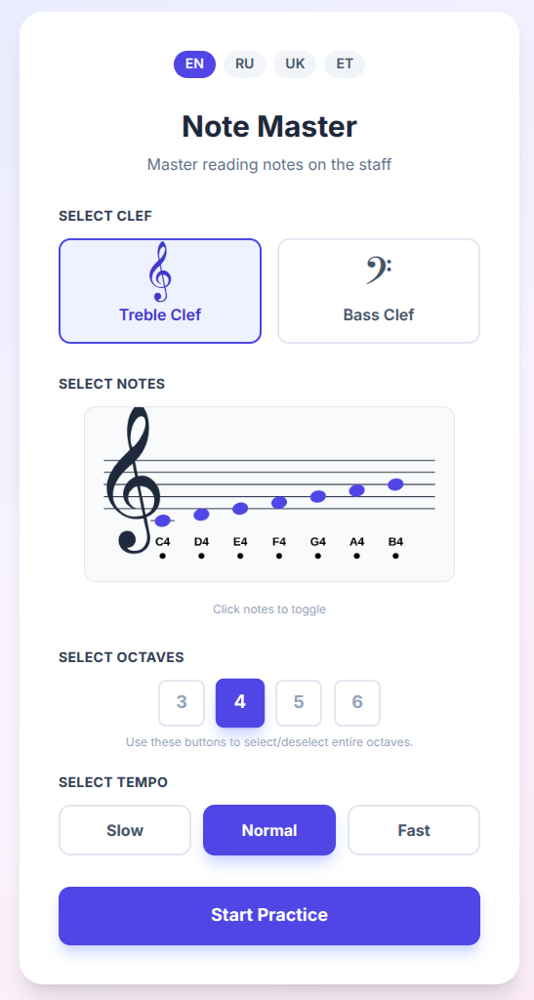
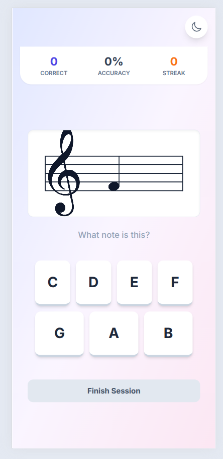
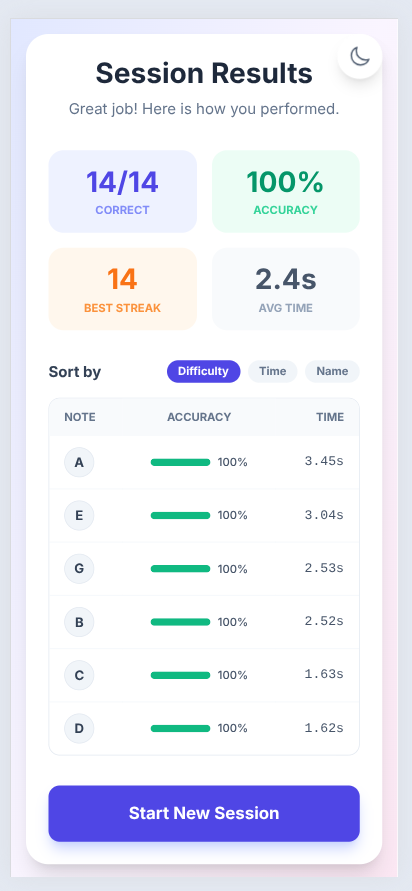

# NoteMeister

Notemeister is a small interactive music-learning web app built with React, TypeScript and Vite. It displays a musical staff and an on-screen keyboard so users can practice identifying notes, hear pitches, and interact with notation in real time.

This README explains how to run, build and contribute to the project, describes the main components and outlines how to extend the app.

## Screenshots

<div align="center">
  
  <p><em>Configuration and settings</em></p>
  
  
  <p><em>Main identification interface</em></p>
  
  
  <p><em>Progress tracking and statistics</em></p>
</div>

## Features

- Interactive staff display with clickable notes and canvas rendering
- Lightweight, dependency-minimal front-end using Vite + React + TypeScript

## Tech stack

- Framework: React
- Language: TypeScript
- Bundler / dev server: Vite

## Quick demo (local)

1. Install dependencies: `npm install`
2. Start dev server: `npm run dev`
3. Open the URL printed by Vite (usually `http://localhost:5173`)

## Getting started

Prerequisites

- Node.js

Install

```bash
npm install
```

Run (development)

```bash
npm run dev
```

Build for production

```bash
npm run build
```

Preview production build locally

```bash
npm run preview
```

## License

This project is provided under the MIT License.
